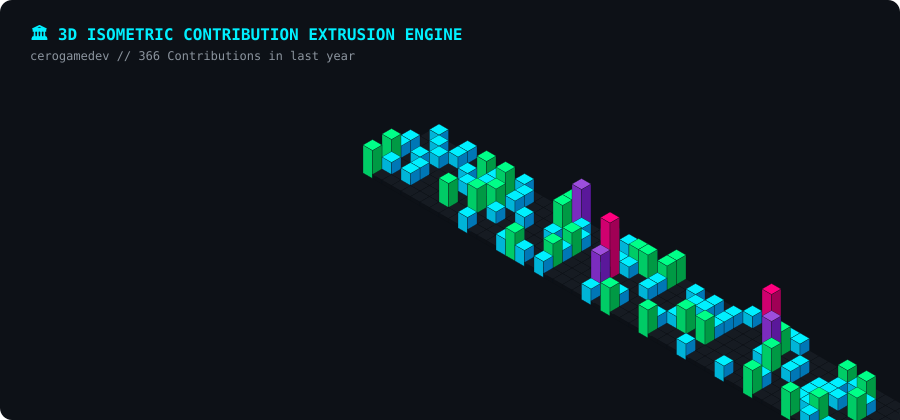

  <!-- Cyberpunk Waving Header Banner -->
  

  <!-- Live Typing SVG -->
  

    

  <!-- Quick Badges -->
  

    
    
    
  

 

> *"Every commit is a structural block in the 3D landscape of game architecture."*

---

## 🏛️ 3D ISOMETRIC CONTRIBUTION EXTRUSION ENGINE

  

---

## 🕹️ SYSTEM COMPONENTS & GAME DESIGN MODULES

<b>📂 [Component 01]: Game Systems & Core Loops (Click to Expand)</b>

 

- **Core Gameplay Loops:** Designing moment-to-moment mechanics and long-term meta progression systems.
- **Game Economy & Balance:** Resource management, difficulty curves (pacing & flow), and mathematical balancing models.
- **Player Psychology & UX:** Creating responsive player input with satisfying feedback loops (Juice, Screen Shake, Audio-Visual Cues).

<b>📂 [Component 02]: Technical Design & C# Architecture (Click to Expand)</b>

 

- **Design Patterns in Unity:** State Machines (FSM), Observer Pattern, Command Pattern, Factory Pattern, and ScriptableObject architecture.
- **Navigation & AI:** NavMesh pathfinding, AI behaviors, and enemy state management.
- **Clean & Modular Code:** Extensible, clean C# codebase built for seamless developer collaboration.

<b>📂 [Component 03]: Shaders & Technical Art (Click to Expand)</b>

 

- **ShaderLab & Technical Art:** Custom HLSL / ShaderGraph solutions for stylized rendering and gameplay VFX.
- **2D/3D Hybrid Visuals:** 2D billboard rendering and dynamic visual management within 3D environments.

---

## 🛠️ EQUIPMENT & TECH STACK

| Core Hardware & Engine | Tech Stack & Frameworks |
| :--- | :--- |
|  |  |
|  |  |

 

`System Architecture` • `Game Balancing` • `Player Psychology` • `NavMesh AI` • `ShaderLab` • `ScriptableObjects`

---

## 🐍 CONTRIBUTION SNAKE ARENA

  <picture>
    <source media="(prefers-color-scheme: dark)" srcset="https://raw.githubusercontent.com/cerogamedev/cerogamedev/output/github-contribution-grid-snake-dark.svg">
    <source media="(prefers-color-scheme: light)" srcset="https://raw.githubusercontent.com/cerogamedev/cerogamedev/output/github-contribution-grid-snake.svg">
    
  </picture>

---

  Automated 3D & Dynamic SVG Engine • <b>OXON Game Studio</b> • <code>cerogamedev</code>

