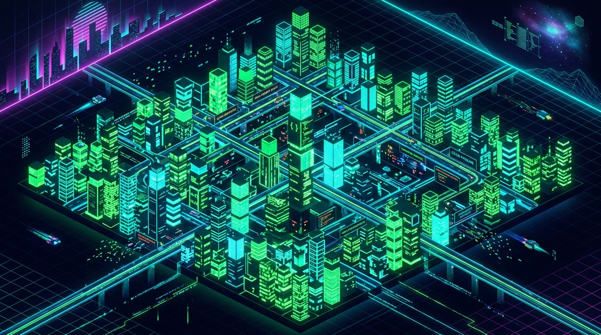

<div align="center">

  <!-- 3D Isometric Cyber Code City Data Visualization Banner -->
  

  <br/><br/>

  <h1>🌆 CEREN GÖR // GAME METRICS CITY</h1>
  <h3><code>System Architect & Game Designer @ OXON</code></h3>

  <p align="center">
    <a href="mailto:ingortigno@gmail.com"></a>
    <a href="https://linkedin.com/in/cerengor" target="_blank"></a>
    <a href="https://github.com/cerogamedev"></a>
  </p>

</div>

<br/>

> *"Every line of code built is a skyscraper in the digital city of game architecture."*

---

## 🏙️ 3D METRICS CITY DIAGNOSTICS

```yaml
City Sector: OXON Game Development District
Primary Infrastructure: Unity 3D & 2D Engine
Core Grid: C# Systems, ShaderLab, NavMesh Pathfinding
Status: 🟢 ONLINE & Expanding High-Rise Code Towers
```

---

## 🏢 CITY DISTRICTS & SYSTEM MODULES

<table width="100%">
  <tr>
    <td width="50%" valign="top">
      <h3>🏛️ District 01: Core Gameplay & Systems</h3>
      <ul>
        <li><b>Mechanics Architecture:</b> Moment-to-moment gameplay loops and difficulty scaling.</li>
        <li><b>Economy & Pacing:</b> Systemic balance models and player retention systems.</li>
        <li><b>Visual & Audio Juice:</b> Haptic, screen shake, and visual feedback design.</li>
      </ul>
    </td>
    <td width="50%" valign="top">
      <h3>⚡ District 02: C# Technical Design</h3>
      <ul>
        <li><b>Engine Patterns:</b> FSM State Machines, Observer, Factory, and ScriptableObjects.</li>
        <li><b>AI & Navigation:</b> NavMesh pathfinding and enemy decision trees.</li>
        <li><b>Modular Codebase:</b> Scalable architecture for team collaboration.</li>
      </ul>
    </td>
  </tr>
  <tr>
    <td width="50%" valign="top">
      <h3>🎨 District 03: Shaders & VFX</h3>
      <ul>
        <li><b>Custom ShaderLab:</b> HLSL render passes and URP post-processing.</li>
        <li><b>Hybrid Visuals:</b> 2D billboard graphics integrated into 3D environments.</li>
      </ul>
    </td>
    <td width="50%" valign="top">
      <h3>🏢 District 04: OXON Headquarters</h3>
      <ul>
        <li><b>Current Role:</b> Game Designer at <b>OXON</b>.</li>
        <li><b>Scope:</b> Prototyping game loops, balancing player systems, and game direction.</li>
      </ul>
    </td>
  </tr>
</table>

---

## 🛠️ INFRASTRUCTURE & TECH STACK

<div align="center">

| Core Hardware & Engine | Tech Stack & Frameworks |
| :--- | :--- |
|  |  |
|  |  |

<br/>

`System Architecture` • `Game Balancing` • `Player Psychology` • `NavMesh AI` • `ShaderLab` • `ScriptableObjects`

</div>

---

## 🐍 CONTRIBUTION SNAKE ARENA

<div align="center">

  <picture>
    <source media="(prefers-color-scheme: dark)" srcset="https://raw.githubusercontent.com/cerogamedev/cerogamedev/output/github-contribution-grid-snake-dark.svg">
    <source media="(prefers-color-scheme: light)" srcset="https://raw.githubusercontent.com/cerogamedev/cerogamedev/output/github-contribution-grid-snake.svg">
    
  </picture>

</div>

---

<div align="center">
  <sub>3D Metrics City • <b>OXON Game Studio</b> • Engineered by <b>Ceren Gör</b></sub>
</div>
