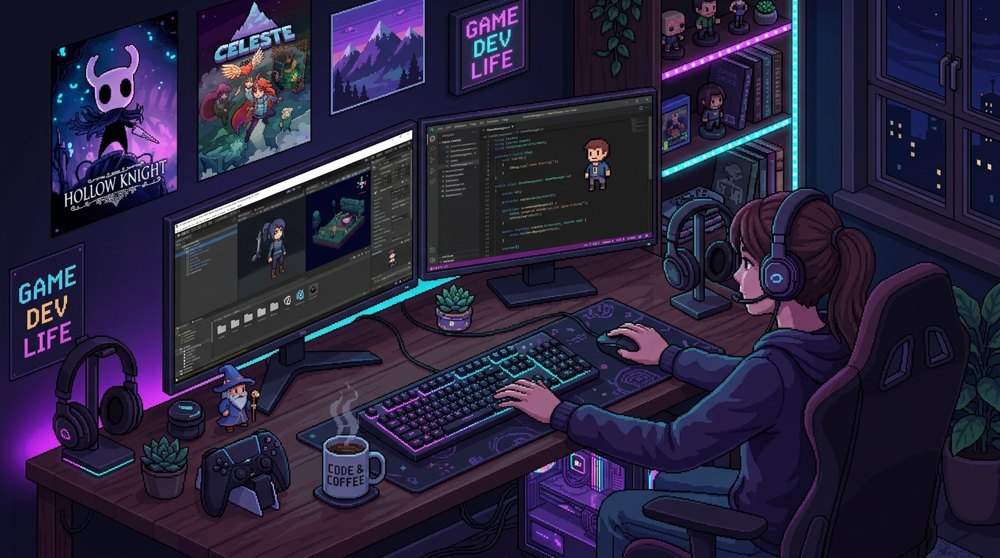

  <!-- Custom Generated Pixel Art Game Designer Workstation Banner -->
  

    

  <h1>✦ CEREN GÖR ✦</h1>
  <h3><code>Game Designer @ OXON</code> • <code>Systems & Mechanics Architect</code></h3>

  

    
    
    
  

 

> *"Games are not just loops of feedback — they are digital emotions engineered through systems, flow, and design."*

---

## 🕹️ GAME DESIGN CRAFT & FOCUS

<table width="100%">
  <tr>
    <td width="50%" valign="top">
      <h3>⚙️ Systems & Core Mechanics</h3>
      <ul>
        <li><b>Moment-to-Moment Loops:</b> Intuitive, responsive, and high-retention mechanics.</li>
        <li><b>Economy & Balance:</b> Resource pacing, difficulty scaling, and systemic depth.</li>
        <li><b>Player UX & Juice:</b> Impactful feedback (screen shake, haptics, visual cues).</li>
      </ul>
    </td>
    <td width="50%" valign="top">
      <h3>💻 Technical Architecture</h3>
      <ul>
        <li><b>Unity & C# Engineering:</b> Modular systems built with Design Patterns (FSM, Observer, Factory).</li>
        <li><b>ScriptableObject Workflows:</b> Clean data-driven architecture for rapid iteration.</li>
        <li><b>NavMesh & Pathfinding:</b> AI behavior trees and spatial pathing logic.</li>
      </ul>
    </td>
  </tr>
  <tr>
    <td width="50%" valign="top">
      <h3>✨ Shaders & Technical Art</h3>
      <ul>
        <li><b>Custom ShaderLab/HLSL:</b> Stylized renderers, URP post-processing passes.</li>
        <li><b>2D/3D Hybrid Art Direction:</b> Billboard rendering and dynamic camera setups.</li>
      </ul>
    </td>
    <td width="50%" valign="top">
      <h3>🏢 Professional Experience</h3>
      <ul>
        <li><b>Current Role:</b> Game Designer at <b>OXON</b>.</li>
        <li><b>Focus:</b> Prototyping game loops, balancing player systems, and shaping core mechanics.</li>
      </ul>
    </td>
  </tr>
</table>

---

## 🛠️ EQUIPMENT & TOOLKIT

| Category | Badges |
| :--- | :--- |
| **Engine & IDE** |     |
| **Core Competencies** | `Game Systems` `Level Design` `UX & Juice` `ScriptableObjects` `NavMesh` `ShaderLab` |

---

## 🐍 CONTRIBUTION ARENA

  <picture>
    <source media="(prefers-color-scheme: dark)" srcset="https://raw.githubusercontent.com/cerogamedev/cerogamedev/output/github-contribution-grid-snake-dark.svg">
    <source media="(prefers-color-scheme: light)" srcset="https://raw.githubusercontent.com/cerogamedev/cerogamedev/output/github-contribution-grid-snake.svg">
    
  </picture>

---

  Crafted with 🎮 & ☕ by <b>Ceren Gör</b> • Game Designer @ <b>OXON</b>

