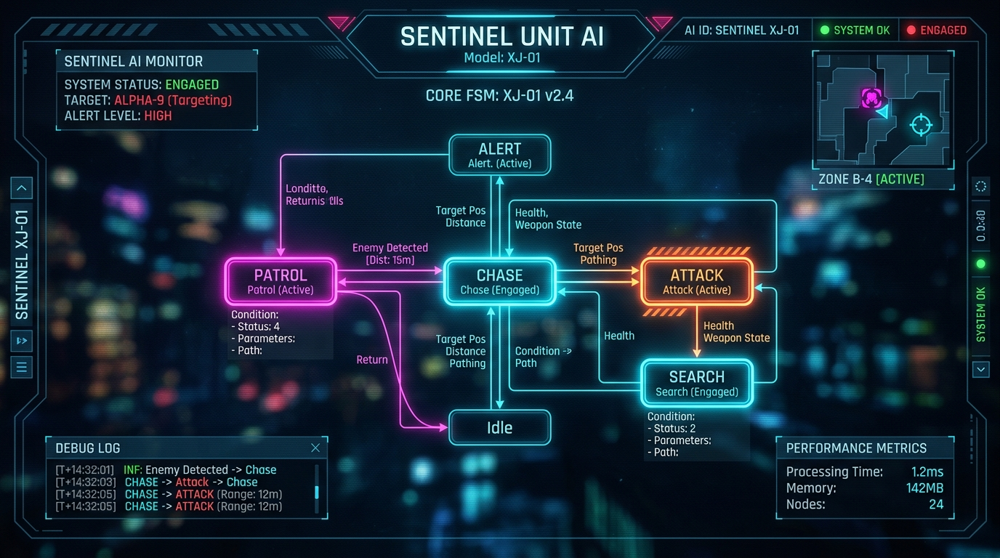

<div align="center">

  <!-- AAA Game AI FSM Debugger HUD Banner -->
  

  <br/><br/>

  <!-- Live Typing Header -->
  <a href="https://git.io/typing-svg">
    
  </a>

  <br/><br/>

  <!-- Quick Badges -->
  <p align="center">
    <a href="mailto:ingortigno@gmail.com"></a>
    <a href="https://linkedin.com/in/cerengor" target="_blank"></a>
    <a href="https://github.com/cerogamedev"></a>
  </p>

</div>

<br/>

> *"Game AI is not about beating the player — it is the choreography of tension, reaction, and dynamic pacing."*

---

## 🧠 REAL-TIME GAME AI STATE MACHINE SIMULATOR

```gcode
========================================================================================
[AI CONTROLLER]: SENTINEL_FSM_v2.4 // ACTIVE STATE: [CHASE]
[TARGET UNIT ]: Player (OXON Game Studio) // ALERT LEVEL: 87% // LATENCY: 1.2ms
========================================================================================
 [PATROL] -------(Player Spotted)------> [ALERT] -------(Target Locked)-------> [CHASE]
    ^                                                                            |
    |                                                                            v
 [IDLE] <-------(Target Lost)----------- [SEARCH] <------(Damage Taken)------- [ATTACK]
========================================================================================
```

### 🎮 SIMULATION TRIGGERS & INPUT COMMANDS

<div align="center">

| Trigger Event | Target State | Condition |
| :--- | :--- | :--- |
| **`⚡ PLAYER_DETECTED`** | **`[CHASE]`** | Distance < 15m & Line of Sight True |
| **`💥 DAMAGE_TAKEN`** | **`[ATTACK / COVER]`** | Health < 50% & Weapon Charged |
| **`🔍 TARGET_LOST`** | **`[SEARCH]`** | Vision Blocked > 3.0s |
| **`🔄 RESET_SYSTEM`** | **`[PATROL]`** | Threat Cleared |

</div>

---

## 💻 GAME AI ARCHITECTURE // C# SOURCE CODE

```csharp
namespace OXON.GameDesign.AI
{
    public enum AIStateType { Idle, Patrol, Alert, Chase, Attack, Search }

    /// <summary>
    /// Core Finite State Machine Architecture for Game AI Logic in Unity
    /// Engineered by Ceren Gör (Game Designer @ OXON)
    /// </summary>
    public class SentinelAIController : MonoBehaviour
    {
        private IAIState _currentState;
        public AIStateType ActiveState { get; private; }

        [Header("AI State Nodes")]
        [SerializeField] private PatrolState _patrolState;
        [SerializeField] private ChaseState _chaseState;
        [SerializeField] private AttackState _attackState;

        private void Start()
        {
            TransitionToState(_patrolState);
        }

        public void TransitionToState(IAIState newState)
        {
            _currentState?.OnExit(this);
            _currentState = newState;
            _currentState?.OnEnter(this);
            ActiveState = newState.Type;
            
            Debug.Log($"[SENTINEL AI]: State Transited -> {ActiveState}");
        }
    }
}
```

---

## 🏛️ 3D ISOMETRIC CONTRIBUTION EXTRUSION ENGINE

<div align="center">

  

</div>

---

## 🕹️ SYSTEM COMPONENTS & GAME DESIGN MODULES

<details>
<summary><b>📂 [Component 01]: Game Systems & Core Loops (Click to Expand)</b></summary>

<br/>

- **Core Gameplay Loops:** Moment-to-moment mechanics and long-term meta progression systems.
- **Game Economy & Balance:** Resource management, difficulty curves (pacing & flow), and mathematical balancing models.
- **Player Psychology & UX:** Responsive player input with satisfying feedback loops (Juice, Screen Shake, Audio-Visual Cues).

</details>

<details>
<summary><b>📂 [Component 02]: Technical Design & C# Architecture (Click to Expand)</b></summary>

<br/>

- **Design Patterns in Unity:** State Machines (FSM), Observer Pattern, Command Pattern, Factory Pattern, and ScriptableObject architecture.
- **Navigation & AI:** NavMesh pathfinding, AI behavior trees, and enemy decision logic.
- **Clean & Modular Code:** Extensible, clean C# codebase built for seamless developer collaboration.

</details>

<details>
<summary><b>📂 [Component 03]: Shaders & Technical Art (Click to Expand)</b></summary>

<br/>

- **ShaderLab & Technical Art:** Custom HLSL / ShaderGraph solutions for stylized rendering and gameplay VFX.
- **2D/3D Hybrid Visuals:** 2D billboard rendering and dynamic visual management within 3D environments.

</details>

---

## 🛠️ EQUIPMENT & TECH STACK

<div align="center">

| Core Hardware & Engine | Tech Stack & Frameworks |
| :--- | :--- |
|  |  |
|  |  |

<br/>

`System Architecture` • `Game Balancing` • `Player Psychology` • `NavMesh AI` • `ShaderLab` • `ScriptableObjects`

</div>

---

## 🐍 CONTRIBUTION SNAKE ARENA

<div align="center">

  <picture>
    <source media="(prefers-color-scheme: dark)" srcset="https://raw.githubusercontent.com/cerogamedev/cerogamedev/output/github-contribution-grid-snake-dark.svg">
    <source media="(prefers-color-scheme: light)" srcset="https://raw.githubusercontent.com/cerogamedev/cerogamedev/output/github-contribution-grid-snake.svg">
    
  </picture>

</div>

---

<div align="center">
  <sub>Real-Time Game AI State Machine Simulator • <b>OXON Game Studio</b> • <code>cerogamedev</code></sub>
</div>
